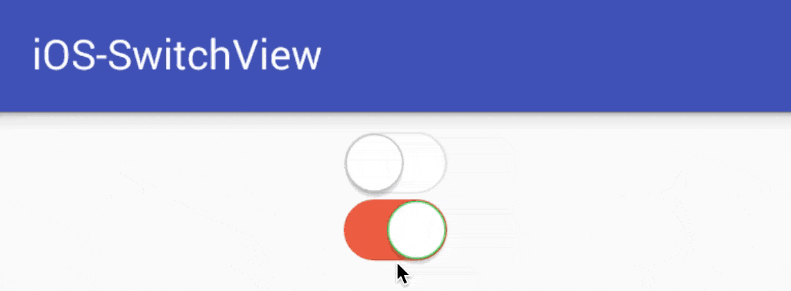

# iOS-SwitchView
[](https://jitpack.io/#luongvo/iOS-SwitchView)

A lightweight iOS switch view style for Android



# Usage
Add SwitchView into xml layout
```xml
<vn.luongvo.widget.iosswitchview.SwitchView
    android:id="@+id/switchview"
    android:layout_width="50dp"
    android:layout_height="wrap_content" />
```
or custom properties:
```xml
<vn.luongvo.widget.iosswitchview.SwitchView
    android:id="@+id/switchview"
    android:layout_width="50dp"
    android:layout_height="wrap_content"
    app:checked="true"
    app:color_off="#e13a8e"
    app:color_on="#ef5e43" />
```
Add listener in activty
```java
switchView.setOnCheckedChangeListener(new SwitchView.OnCheckedChangeListener() {
    @Override
    public void onCheckedChanged(SwitchView switchView, boolean isChecked) {
        Toast.makeText(MainActivity.this, "onCheckedChanged: " + isChecked, Toast.LENGTH_SHORT).show();
    }
});
```

# Installation
**Step 1.** Add the JitPack repository to your build file
```groovy
allprojects {
    repositories {
        ...
        maven { url "https://jitpack.io" }
    }
}
```
**Step 2.** Add the dependency
```groovy
dependencies {
    compile 'com.github.luongvo:iOS-SwitchView:1.0.0'
}
```
